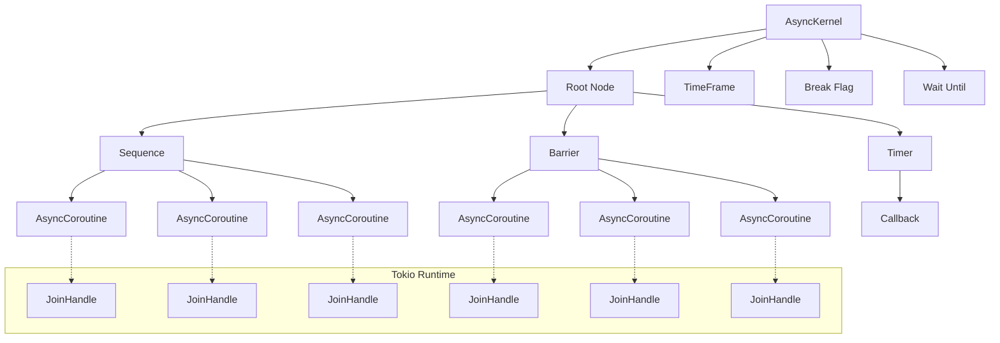
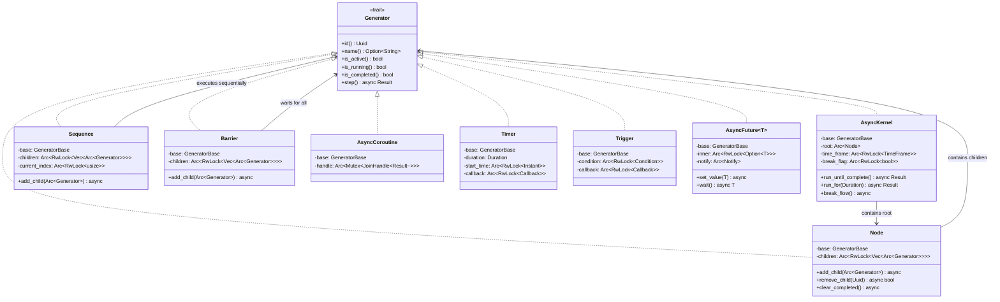
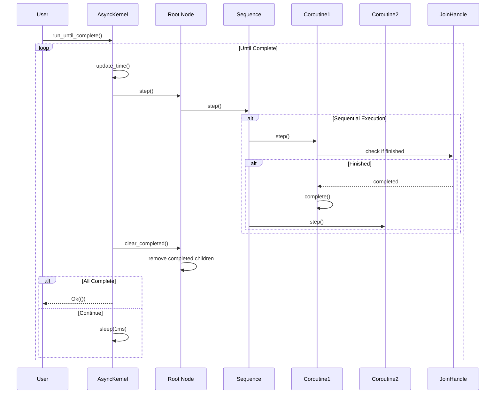
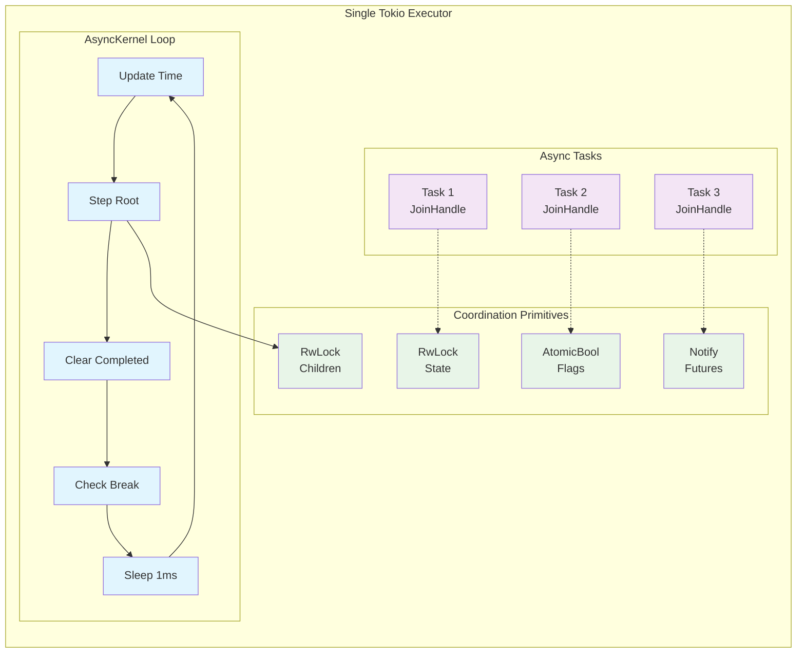

# AsyncFlow

A thread-free, async/await-based flow control system for Rust, inspired by CsharpFlow. This library provides coroutine-like functionality using Rust's native async/await for cooperative multitasking.

## Features

- **Thread-free**: Uses async/await and tokio for concurrency without threads
- **Flow Control**: Sequences, barriers, triggers, timers, and futures
- **Composable**: Build complex flow graphs from simple components  
- **Async Native**: Designed for Rust's async ecosystem
- **Memory Safe**: Leverages Rust's ownership system for safe concurrent programming

## Core Components

### Generators
Base abstraction for all flow components with lifecycle management:
- `AsyncCoroutine` - Wraps async functions
- `SyncCoroutine` - Wraps synchronous step functions  
- `Node` - Container for child generators
- `Sequence` - Executes children sequentially
- `Barrier` - Waits for all children to complete
- `Timer` - One-shot timer with callback
- `PeriodicTimer` - Repeating timer with callback
- `Trigger` - Fires when condition becomes true
- `AsyncFuture` - Thread-safe future value

### Kernel
The `AsyncKernel` manages the execution of the flow graph:
- `run_until_complete()` - Run until all tasks finish
- `run_for(duration)` - Run for specified time
- `break_flow()` - Stop execution
- `wait(duration)` - Pause execution

## Examples

### Basic Timer Example
```rust
use async_flow::*;
use std::time::Duration;

#[tokio::main]
async fn main() -> Result<()> {
    let kernel = AsyncKernel::new();
    let root = kernel.root();
    
    let timer = FlowFactory::new_periodic_timer_with_name(
        "Heartbeat", 
        Duration::from_millis(500)
    );
    
    timer.set_elapsed_callback(|| {
        println!("Heartbeat!");
    }).await;
    
    root.add_child(timer).await;
    kernel.run_for(Duration::from_secs(3)).await?;
    
    Ok(())
}
```

### Sequence Example
```rust
use async_flow::*;

async fn task(name: &str) -> Result<()> {
    println!("Running task: {}", name);
    tokio::time::sleep(Duration::from_millis(100)).await;
    println!("Completed task: {}", name);
    Ok(())
}

#[tokio::main] 
async fn main() -> Result<()> {
    let kernel = AsyncKernel::new();
    let sequence = FlowFactory::new_sequence_with_name("TaskSequence");
    
    sequence.add_child(FlowFactory::new_async_coroutine_with_name(
        "Task1", task("Alpha")
    )).await;
    
    sequence.add_child(FlowFactory::new_async_coroutine_with_name(
        "Task2", task("Beta")  
    )).await;
    
    kernel.root().add_child(sequence).await;
    kernel.run_until_complete().await?;
    
    Ok(())
}
```

### Barrier Example
```rust  
use async_flow::*;

#[tokio::main]
async fn main() -> Result<()> {
    let kernel = AsyncKernel::new();
    let barrier = FlowFactory::new_barrier_with_name("ParallelTasks");
    
    // These tasks run concurrently
    for i in 1..=3 {
        let task = FlowFactory::new_async_coroutine_with_name(
            format!("Task{}", i),
            async move {
                println!("Starting task {}", i);
                tokio::time::sleep(Duration::from_millis(i * 100)).await;
                println!("Finished task {}", i);
                Ok(())
            }
        );
        barrier.add_child(task).await;
    }
    
    let after_barrier = FlowFactory::new_async_coroutine_with_name(
        "Cleanup",
        async {
            println!("All parallel tasks completed!");
            Ok(())
        }
    );
    
    let sequence = FlowFactory::new_sequence();
    sequence.add_child(barrier).await;
    sequence.add_child(after_barrier).await;
    
    kernel.root().add_child(sequence).await;
    kernel.run_until_complete().await?;
    
    Ok(())
}
```

## Running Examples

```bash
cargo run --example basic_example
cargo run --example game_loop_example  
cargo run --example barrier_example
cargo run --example future_example
```

## Running Tests

```bash
cargo test
```

## Comparison with CsharpFlow

| Feature | CsharpFlow | AsyncFlow |
|---------|------------|-----------|
| Language | C# | Rust |
| Memory Model | GC + locking | Ownership + Arc/RwLock |
| Coroutines | IEnumerator | async functions |
| Performance | Managed runtime | Zero-cost async |
| Safety | Runtime errors | Compile-time safety |

## Architecture

AsyncFlow uses a hierarchical structure where:
- `AsyncKernel` manages the root execution loop  
- `Node` containers hold child generators
- Each generator can be stepped independently
- Async coordination happens through Rust's async runtime
- No threads are created - everything runs on the tokio executor

### System Architecture



### Component Relationships



### Flow Execution Model



### Thread-Free Coordination



This provides the same flow control capabilities as CsharpFlow while leveraging Rust's zero-cost async abstractions and memory safety guarantees.
