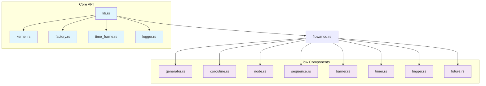
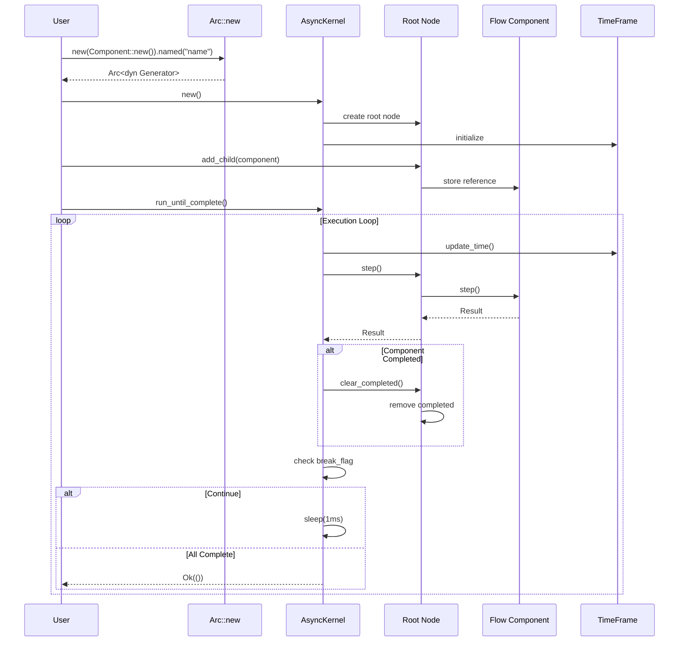
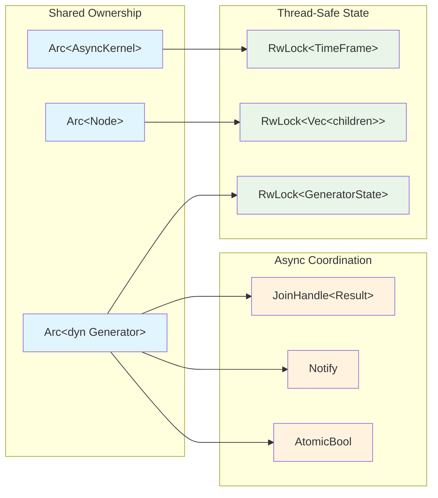

# AsyncFlow Source Code Structure

This directory contains the core implementation of the AsyncFlow library, a thread-free async/await-based flow control system for Rust.

## Module Overview

### Core Modules

- **`lib.rs`** - Main library entry point with public API exports
- **`kernel.rs`** - `AsyncKernel` implementation for managing flow execution
- **`factory.rs`** - `Named` trait for fluent component naming
- **`time_frame.rs`** - Time management and tracking utilities
- **`logger.rs`** - Logging infrastructure for flow debugging

### Flow Components (`flow/` directory)

- **`generator.rs`** - Base `Generator` trait and `GeneratorBase` implementation
- **`coroutine.rs`** - `AsyncCoroutine` and `SyncCoroutine` implementations
- **`node.rs`** - `Node` container for managing child generators
- **`sequence.rs`** - `Sequence` for sequential execution of children
- **`barrier.rs`** - `Barrier` for parallel execution and synchronization
- **`timer.rs`** - `Timer` and `PeriodicTimer` implementations
- **`trigger.rs`** - `Trigger` for condition-based activation
- **`future.rs`** - `AsyncFuture` for thread-safe value passing

## Source Code Structure



## Component Hierarchy

```mermaid
graph TB
    Generator[Generator Trait<br/>generator.rs]
    
    Generator --> AsyncKernel[AsyncKernel<br/>kernel.rs]
    Generator --> Node[Node<br/>node.rs]
    Generator --> Sequence[Sequence<br/>sequence.rs]
    Generator --> Barrier[Barrier<br/>barrier.rs]
    Generator --> AsyncCoroutine[AsyncCoroutine<br/>coroutine.rs]
    Generator --> SyncCoroutine[SyncCoroutine<br/>coroutine.rs]
    Generator --> Timer[Timer<br/>timer.rs]
    Generator --> PeriodicTimer[PeriodicTimer<br/>timer.rs]
    Generator --> Trigger[Trigger<br/>trigger.rs]
    Generator --> AsyncFuture[AsyncFuture<br/>future.rs]
    
    Named[Named Trait<br/>factory.rs] -.-> Node
    Named -.-> Sequence
    Named -.-> Barrier
    Named -.-> AsyncCoroutine
    Named -.-> SyncCoroutine
    Named -.-> Timer
    Named -.-> PeriodicTimer
    Named -.-> Trigger
    Named -.-> AsyncFuture
    
    TimeFrame[TimeFrame<br/>time_frame.rs] -.-> AsyncKernel
    Logger[Logger<br/>logger.rs] -.-> AsyncKernel
    
    classDef trait fill:#ffeb3b,color:#000
    classDef core fill:#e1f5fe
    classDef container fill:#e8f5e8
    classDef execution fill:#fff3e0
    classDef timing fill:#fce4ec
    classDef utility fill:#f5f5f5
    
    class Generator trait
    class AsyncKernel,Named,TimeFrame,Logger core
    class Node,Sequence,Barrier container
    class AsyncCoroutine,SyncCoroutine execution
    class Timer,PeriodicTimer,Trigger,AsyncFuture timing
```



## Data Flow Architecture



## Memory Management



## Architecture Overview

The codebase follows a hierarchical component model where all flow components implement the `Generator` trait and can be composed into complex execution graphs.

### Key Design Principles

1. **Thread-Free**: All coordination happens through async/await and tokio primitives
2. **Composable**: Components can be nested and combined arbitrarily
3. **Memory Safe**: Uses Arc/RwLock for shared state without data races
4. **Zero-Cost**: Leverages Rust's zero-cost async abstractions

## Usage Patterns

Components are typically created using direct constructors with fluent naming:

```rust
use std::sync::Arc;

let kernel = AsyncKernel::new();
let sequence = Arc::new(Sequence::new()).named("MySequence");
sequence.add_child(some_coroutine).await;
kernel.root().add_child(sequence).await;
kernel.run_until_complete().await?;
```

## Related Documentation

- [Main README](../README.md) - Project overview, examples, and user guide
- [Flow Components](flow/README.md) - Detailed implementation of flow control components
- [Timed Components Guide](../docs/TIMED_COMPONENTS.md) - Advanced timing patterns

## Testing

Related test files are located in the `../tests/` directory:
- `integration_tests.rs` - End-to-end flow scenarios
- `timed_components_tests.rs` - Timer and trigger testing
- `reliable_timed_tests.rs` - Deterministic timing tests
- `extended_timed_tests.rs` - Advanced timing patterns
- `timed_patterns_tests.rs` - Complex timing combinations

## Examples

Example usage can be found in `../examples/` showcasing various flow patterns and component combinations.
