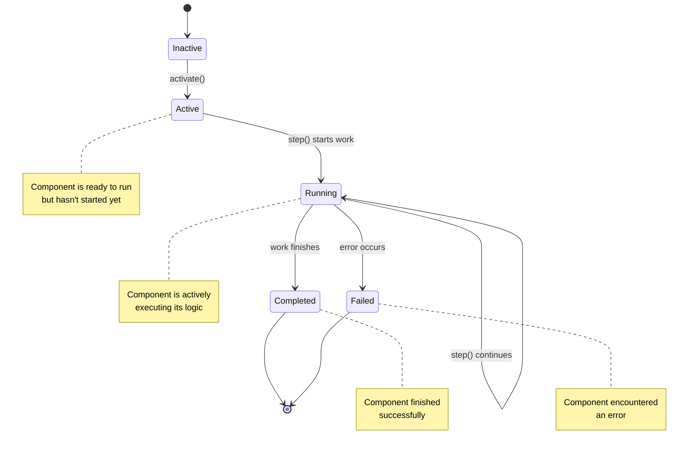
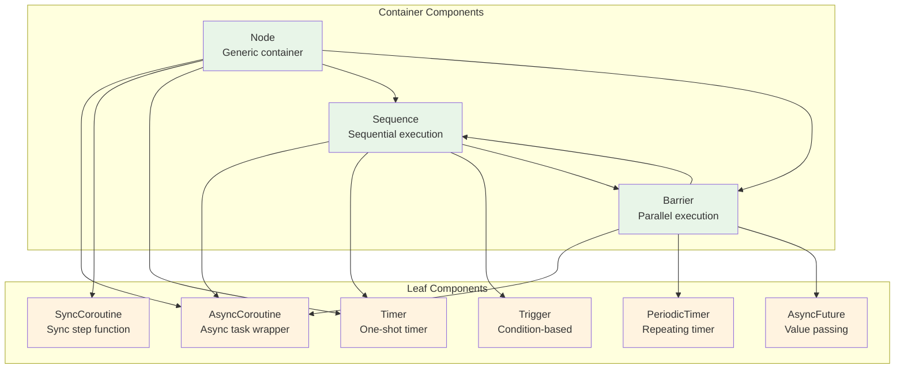
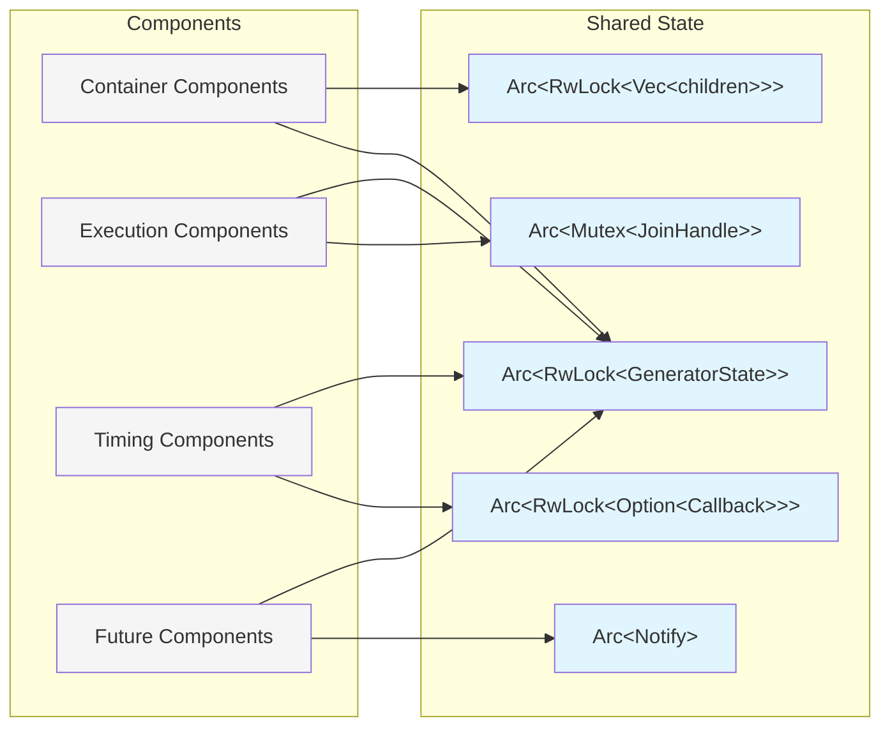

# Flow Components

This directory contains the core flow control components that implement the `Generator` trait. These components can be composed to create complex async execution patterns.

## Components Overview

### Base Components
- **`generator.rs`** - Core `Generator` trait and `GeneratorBase` shared implementation
- **`node.rs`** - Generic container that manages child generators

### Execution Control
- **`sequence.rs`** - Sequential execution - runs children one after another
- **`barrier.rs`** - Parallel execution - runs all children concurrently, waits for completion
- **`coroutine.rs`** - Task wrappers for async functions and sync step functions

### Timing Components
- **`timer.rs`** - One-shot and periodic timers with callbacks
- **`trigger.rs`** - Condition-based activation with callbacks
- **`future.rs`** - Thread-safe value passing between components

## Component Inheritance Hierarchy

```mermaid
classDiagram
    class Generator {
        <<trait>>
        +id() Uuid
        +name() Option String
        +is_active() bool
        +is_running() bool
        +is_completed() bool
        +step() async Result
        +complete() async
        +activate() async
    }
    
    class GeneratorBase {
        -id: Uuid
        -name: Option String
        -state: Arc RwLock GeneratorState
        +new(name) Self
        +set_state(GeneratorState) async
        +get_state() async GeneratorState
    }
    
    class Node {
        -base: GeneratorBase
        -children: Arc RwLock Vec Children
        +add_child(Generator) async
        +remove_child(Uuid) async bool
        +clear_completed() async
    }
    
    class Sequence {
        -base: GeneratorBase
        -children: Arc RwLock Vec Children
        -current_index: Arc RwLock usize
        +add_child(Generator) async
        +get_current_child() async Option Generator
    }
    
    class Barrier {
        -base: GeneratorBase
        -children: Arc RwLock Vec Children
        +add_child(Generator) async
        +all_children_completed() async bool
    }
    
    class AsyncCoroutine {
        -base: GeneratorBase
        -handle: Arc Mutex JoinHandle
        +new(name, future) Self
    }
    
    class SyncCoroutine {
        -base: GeneratorBase
        -step_func: Arc Mutex StepFunction
        +new(name, step_func) Self
    }
    
    class Timer {
        -base: GeneratorBase
        -duration: Duration
        -start_time: Arc RwLock Option Instant
        -callback: Arc RwLock Option Callback
        +new(name, duration) Self
        +set_elapsed_callback(callback) async
    }
    
    class PeriodicTimer {
        -base: GeneratorBase
        -interval: Duration
        -last_tick: Arc RwLock Instant
        -callback: Arc RwLock Option Callback
        +new(name, interval) Self
        +set_elapsed_callback(callback) async
    }
    
    class Trigger {
        -base: GeneratorBase
        -condition: Arc RwLock Option ConditionFn
        -callback: Arc RwLock Option Callback
        -was_triggered: Arc RwLock bool
        +new(name, condition) Self
        +set_trigger_callback(callback) async
    }
    
    class AsyncFuture {
        -base: GeneratorBase
        -inner: Arc RwLock Option T
        -notify: Arc Notify
        +new(name) Self
        +set_value(value) async
        +wait() async T
    }
    
    Generator <|.. Node
    Generator <|.. Sequence
    Generator <|.. Barrier
    Generator <|.. AsyncCoroutine
    Generator <|.. SyncCoroutine
    Generator <|.. Timer
    Generator <|.. PeriodicTimer
    Generator <|.. Trigger
    Generator <|.. AsyncFuture
    
    GeneratorBase --o Node
    GeneratorBase --o Sequence
    GeneratorBase --o Barrier
    GeneratorBase --o AsyncCoroutine
    GeneratorBase --o SyncCoroutine
    GeneratorBase --o Timer
    GeneratorBase --o PeriodicTimer
    GeneratorBase --o Trigger
    GeneratorBase --o AsyncFuture
    
    classDef trait fill:#ffeb3b,color:#000
    classDef base fill:#e1f5fe
    classDef container fill:#e8f5e8
    classDef execution fill:#fff3e0
    classDef timing fill:#fce4ec
    
    class Generator trait
    class GeneratorBase base
    class Node container
    class Sequence container
    class Barrier container
    class AsyncCoroutine execution
    class SyncCoroutine execution
    class Timer timing
    class PeriodicTimer timing
    class Trigger timing
    class AsyncFuture timing
```



## Component Execution Patterns

```mermaid
flowchart TD
    subgraph "Sequential Execution"
        S[Sequence] --> C1[Child 1]
        C1 --> |completes| C2[Child 2]
        C2 --> |completes| C3[Child 3]
        C3 --> |completes| SE[Sequence Complete]
    end
    
    subgraph "Parallel Execution"
        B[Barrier] --> P1[Child 1]
        B --> P2[Child 2]
        B --> P3[Child 3]
        P1 --> |all complete| BE[Barrier Complete]
        P2 --> |all complete| BE
        P3 --> |all complete| BE
    end
    
    subgraph "Timing Components"
        T[Timer] --> |duration elapsed| TC[Callback]
        PT[PeriodicTimer] --> |interval elapsed| PTC[Callback]
        PTC --> |repeat| PT
        TR[Trigger] --> |condition true| TRC[Callback]
    end
    
    subgraph "Value Passing"
        F[AsyncFuture] --> |set_value| W[Waiting Tasks]
        W --> |notified| R[Resume Execution]
    end
    
    classDef seq fill:#e8f5e8
    classDef par fill:#fff3e0
    classDef time fill:#fce4ec
    classDef val fill:#f3e5f5
    
    class S seq
    class C1 seq
    class C2 seq
    class C3 seq
    class SE seq
    class B par
    class P1 par
    class P2 par
    class P3 par
    class BE par
    class T time
    class TC time
    class PT time
    class PTC time
    class TR time
    class TRC time
    class F val
    class W val
    class R val
```



## State Management



## Component Relationships



## Thread Safety

All components use Arc/RwLock for thread-safe shared state:



## Usage Examples

### Creating a Sequential Flow
```rust
let sequence = FlowFactory::new_sequence_with_name("TaskFlow");
sequence.add_child(task1).await;
sequence.add_child(task2).await;
sequence.add_child(task3).await;
```

### Creating a Parallel Flow
```rust
let barrier = FlowFactory::new_barrier_with_name("ParallelTasks");
barrier.add_child(concurrent_task1).await;
barrier.add_child(concurrent_task2).await;
barrier.add_child(concurrent_task3).await;
```

### Timed Operations
```rust
let timer = FlowFactory::new_timer_with_name("Delay", Duration::from_secs(5));
timer.set_elapsed_callback(|| println!("Timer finished!")).await;

let trigger = FlowFactory::new_trigger_with_name("Condition", move || check_condition());
trigger.set_trigger_callback(|| println!("Condition met!")).await;
```

Each component is designed to be composable, allowing complex execution patterns through simple composition.

## Related Documentation

- [Main README](../../README.md) - Project overview, examples, and user guide  
- [Source Code Structure](../README.md) - Overall codebase architecture
- [Timed Components Guide](../../docs/TIMED_COMPONENTS.md) - Advanced timing patterns and examples

## See Also

- `../factory.rs` - `FlowFactory` methods for creating these components
- `../kernel.rs` - `AsyncKernel` that manages component execution
- `../../examples/` - Usage examples for all components
- `../../tests/` - Comprehensive test suites for component behavior